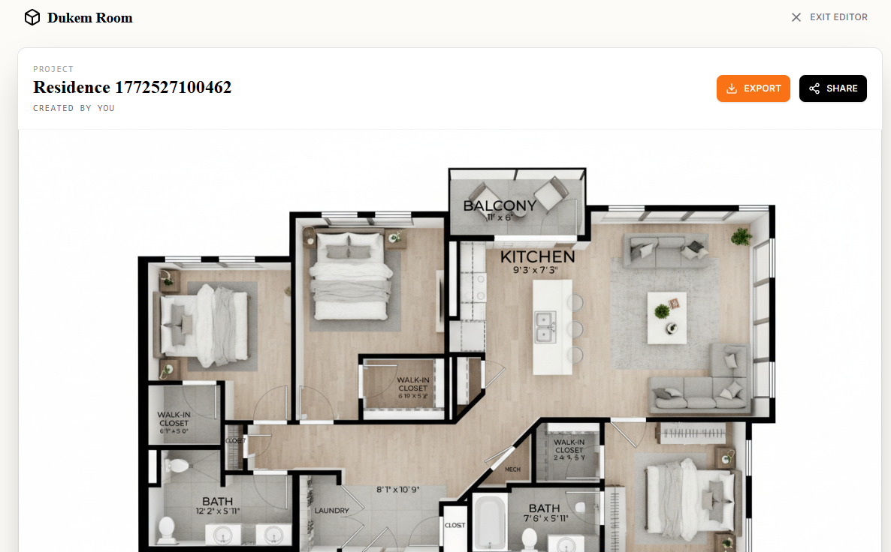
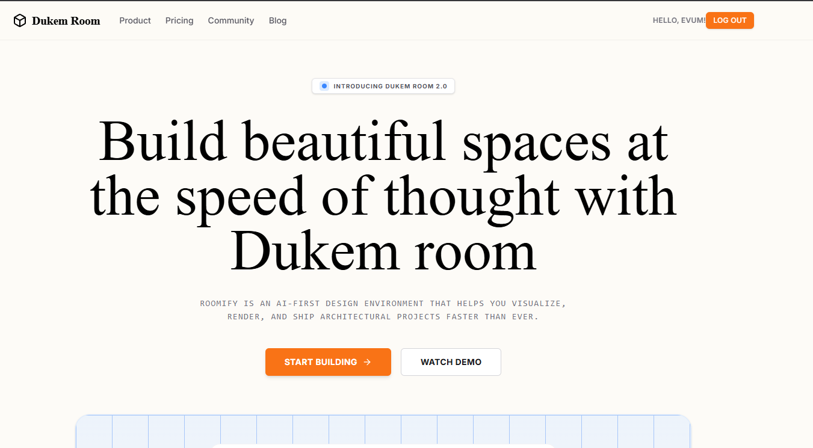

# Dukem Room (Roomify)

An AI-powered room visualizer application that transforms 2D floor plans into photorealistic top-down 3D architectural renders using Generative AI.



## 🚀 Features

- **2D to 3D Conversion**: Upload a floor plan and generate a 3D visualization instantly.
- **AI-Powered**: Utilizes `gemini-2.5-flash-image-preview` via Puter.ai for high-quality generation.
- **Interactive Comparison**: "Before and After" slider to visualize changes.
- **Cloud Storage**: Automatically saves projects and images using **Puter.js** Hosting and KV storage.
- **Export & Share**: Download generated renders or share project links (coming soon).

## 🛠 Tech Stack

- **Framework**: [React Router v7](https://reactrouter.com/) (SSR enabled)
- **Styling**: [Tailwind CSS v4](https://tailwindcss.com/)
- **Backend & AI**: [Puter.js](https://docs.puter.com/)
  - **Auth**: User authentication
  - **KV**: Project metadata storage
  - **Hosting**: Image file storage (dynamic subdomains)
  - **AI**: Text-to-Image generation
  - **Workers**: Backend logic (`lib/puter.worker.js`)
- **Build Tool**: Vite

## ⚡ Getting Started

### Prerequisites

- Node.js (v20 or newer)
- npm or yarn

### Installation

1. Clone the repository:
   ```bash
   git clone https://github.com/vvduth/dukem-room.git
   cd dukem-room
   ```

2. Install dependencies:
   ```bash
   npm install
   ```

### Configuration

Create a `.env` file in the root directory if you are connecting to a custom backend worker (optional, defaults to production worker):

```env
VITE_PUTER_WORKER_URL="https://your-puter-worker-url.puter.work"
```



### Running Locally

Start the development server:

```bash
npm run dev
```

Open [http://localhost:5173](http://localhost:5173) in your browser.

## 📦 Deployment

### Frontend

Build the application for production:

```bash
npm run build
```

You can deploy the output to any platform that supports Node.js or request a static adapter if needed.

### Backend (Puter Worker)

The backend logic resides in `lib/puter.worker.js`. To deploy:

1. Create a new Worker on [Puter.com](https://puter.com).
2. Copy the contents of `lib/puter.worker.js` into the worker.
3. Save and Deploy.
4. Update `VITE_PUTER_WORKER_URL` in your frontend configuration with the new worker URL.

## 🤝 Contributing

Contributions are welcome! Please open an issue or submit a pull request.

## 📄 License

This project is licensed under the MIT License.
